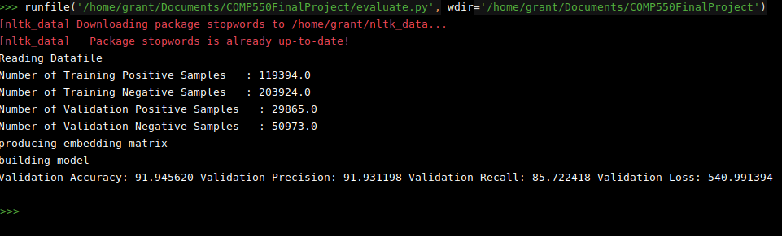

*Based on implementation by [fionn-mac](https://github.com/fionn-mac/Manhattan-LSTM)*

Download pretrained word2vec model from [here](https://drive.google.com/uc?id=0B7XkCwpI5KDYNlNUTTlSS21pQmM&export=download)

Download Quera Dataset [here](https://www.kaggle.com/c/quora-question-pairs/data)

Trained model download [link](https://drive.google.com/open?id=1wRfQhW15rXHzTc70ZcmregAIz5DL1slF)

**TODOs are up for grab, please take them**

1. missing generate result file on the test set, after we have that we can upload to kaggle to see performance.
2. many more in scripts

install requirement by
```
pip3 install -r requirement.txt
```
run the line below to train
```
python3 training.py
```
run the line below to test on validate set
```
python3 evaluate.py
```
modify hyperparameters.py to change stuff

preliminary result (for some wired reason if I change batch size, result varies)


